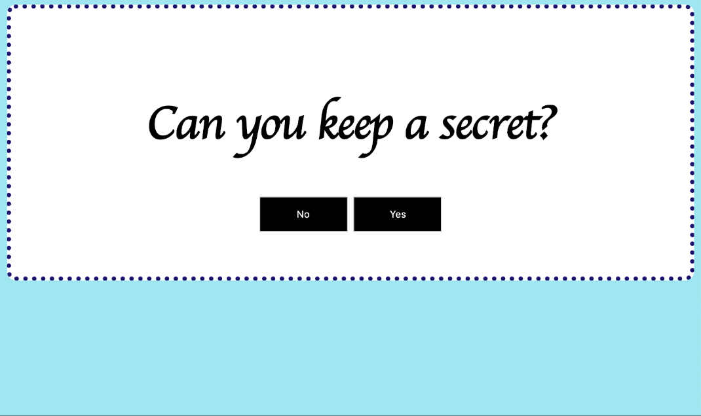

# Can you keep a secret?

We're going to be creating a page that looks like this and then doing some cool stuff with jQuery:



#### Index.html: Buttons Box
- In your index.html, add an `h1` inside the buttons-box `<div>` that says "Can you keep a secret?". 
- Below your `h1`, add 2 buttons. These buttons will be for people to answer our question, "Can you keep a secret?". One button should say "Yes" and the other button should say "No".
- Now add an ID onto both buttons. One ID should be "yes-secret" and the other ID should be "no-secret".


#### Index.html: Secrets Box
- Inside the "secrets-box" `<div>`, add an `h2` that says, "Congrats, you have found my secrets!"
- Below your `h2` add an unordered list with your 3 secrets. Example: 
	```
		<ul>
			<li>I love the color blue</li>
			<li>I love my dog so much!!</li>
			<li>I have a secret crush on Joe</li>
		</ul>
	```

#### Index.html: Go Away Box
- Inside the "go-away-box" `<div>`, add an `h2` that says, "GO AWAY!!!"
- Below that, add a `p` tag that says, "Secret spillers are not welcome here!"


#### Style.css: Buttons Box
- Inside your style.css, change the background color of the entire page to aqua. 
- Add a border around the buttons-box
- Set the border radius of the buttons-box to 15px. 
- Center the text of the buttons-box. 
- Set the background color of the buttons-box to white. 
- Add 15px of padding to the buttons-box


#### Style.css: Secrets Box
- Style the secrets-box with all the same properties as the buttons-box, but make these changes: 
	- Make the background color a different color
	- Set the font-family to `cursive`
	- Change the color of the text to blue


#### Style.css: Buttons
- Change the background color of the buttons to black
- Change the text color of the buttons to white
- Set a width of 100px 
- Set a height of 40px


#### Action Time!
- We are going to hide the secrets-box and go-away-box. We'll do that with CSS. Add `display: none` to the CSS of the secrets-box and go-away-box. Refresh the page in Chrome and make sure only the buttons-box is showing.
- Inside the script.js, we are going to make our yes-secret button show our secrets. Add this code to your script.js
	```
	 // Write your JavaScript below
	 $("#yes-secret").click(function(){
	 	
	 });
	```
- When the yes-secret button is clicked, the code between the curly-braces will run. We have no code in there now, so let's add some! Write code to `hide` the buttons-box inside the curly braces.
- Test your code and make sure when you click the 'Yes' button the buttons-box disappears. 
- Now let's `show` the secrets-box when the 'Yes' button is clicked.
- Now do the same thing for the no-secret button, only we want to `show` the go-away-box.


#### Extensions
- Add a "Maybe" button to your HTML page that works just like the Yes and No buttons work. You'll need to do the following:
	- Add a Maybe button to the HTML page
	- Add a maybe-box `div` to the index.html
	- Add some HTML elements into the maybe-box
	- Style the maybe-box in style.css
	- Hide the maybe-box using `display: none`
	- Add some JavaScript code to show the maybe-box when the "Maybe" button is clicked! 
- Add some images/gifs into your buttons-box. Will these also be hidden after you click "Yes", "No", or "Maybe"?
- See if you can figure out how to show your secrets when you hover over your image. 